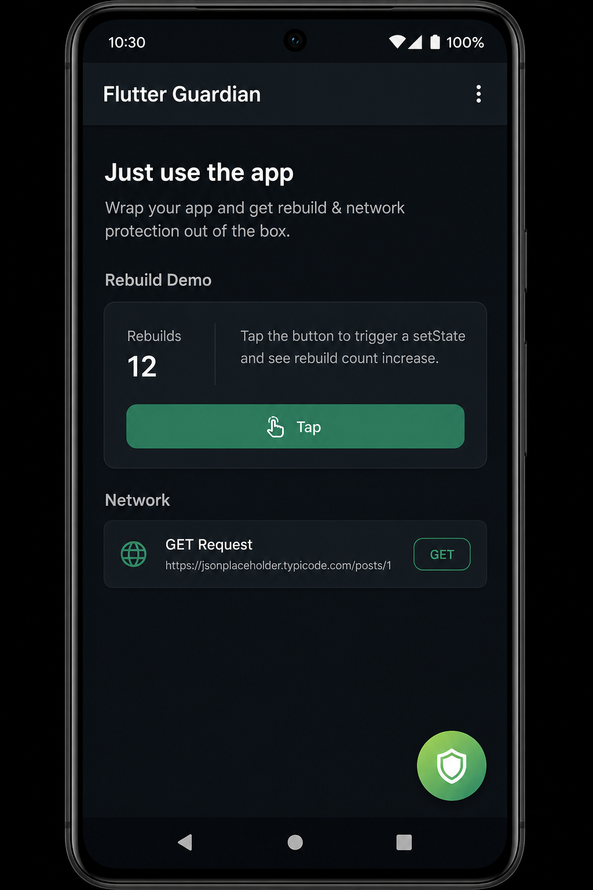
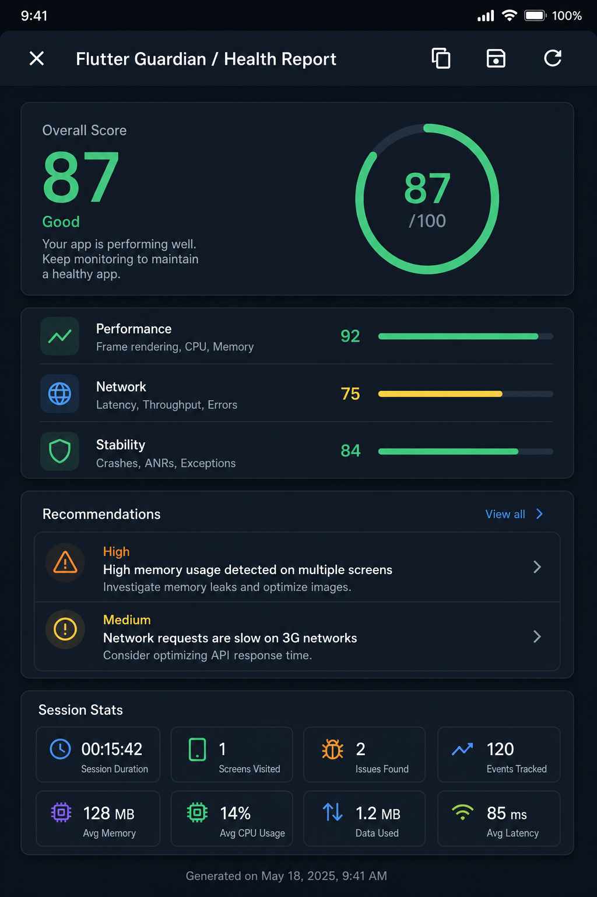
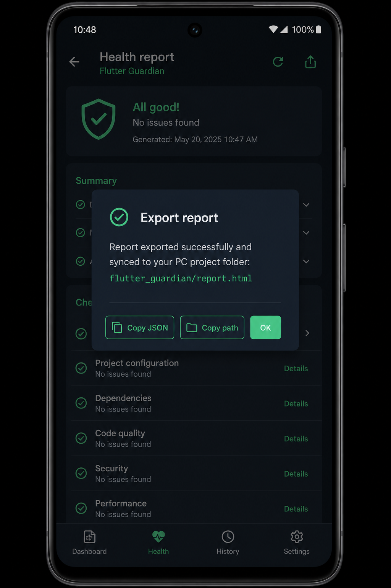
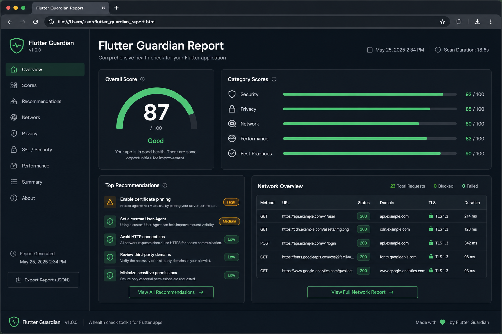
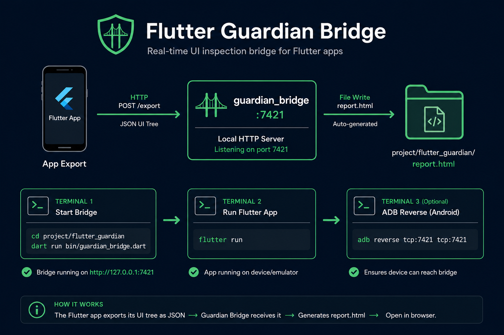

# Flutter Health Guard

> **The Lighthouse of Flutter** — add one init line, use your app, open a scored health report.

`flutter_health_guard` watches a debug session (crashes, network, performance, navigation, lifecycle, device), scores it, and gives **rule-based recommendations**. View results in the app, or export `report.html` / `report.json` to your project folder.

<p align="center">
  
  &nbsp;
  
</p>

<p align="center">
  <em>Left: green shield FAB · Right: in-app Health Report</em>
</p>

> Package / repo: **`flutter_health_guard`** — [github.com/huzaifamirza0/flutter_health_guard](https://github.com/huzaifamirza0/flutter_health_guard)

---

## Table of contents

1. [Features](#features)
2. [Installation](#installation)
3. [5-minute setup](#5-minute-setup)
4. [Using the in-app report](#using-the-in-app-report)
5. [Exporting files to your project folder](#exporting-files-to-your-project-folder)
6. [What gets collected](#what-gets-collected)
7. [Scores & recommendations](#scores--recommendations)
8. [API overview](#api-overview)
9. [Configuration](#configuration)
10. [Example app](#example-app)
11. [Platform support](#platform-support)
12. [Limitations](#limitations-v01)
13. [Docs](#docs)
14. [Roadmap](#roadmap)
15. [Contributing](#contributing)
16. [License](#license)

---

## Features

| Feature | Description |
|---------|-------------|
| **One-line init** | `await Guardian.initialize()` before `runApp` |
| **Draggable FAB** | `GuardianOverlay` — tap to open the report |
| **In-app report** | Scores, recommendations, network, crashes, navigation |
| **One-click export** | Save icon writes HTML/JSON (not a continuous PC sync) |
| **Host bridge** | Optional: sync phone reports into `<project>/flutter_health_guard/` |
| **HTML dashboard** | Offline `report.html` you can open in a browser or email |
| **`report.json`** | Source of truth for all renderers |

```
Flutter App
    │
    ▼
Collectors (crash, network, perf, nav, …)
    │
    ▼
Analyzer → Score Engine → Recommendations
    │
    ├── In-app UI (GuardianOverlay)
    └── Files: report.json → report.html + CLI summary
```

---

## Installation

**Git (recommended):**

```yaml
dependencies:
  flutter_health_guard:
    git:
      url: https://github.com/huzaifamirza0/flutter_health_guard.git
      ref: main
```

**Path (local clone):**

```yaml
dependencies:
  flutter_health_guard:
    path: ../flutter_health_guard
```

```bash
flutter pub get
```

---

## 5-minute setup

### 1. Initialize in `main`

```dart
import 'package:flutter/foundation.dart';
import 'package:flutter/material.dart';
import 'package:flutter_health_guard/flutter_health_guard.dart';

Future<void> main() async {
  await Guardian.initialize(); // start collectors
  runApp(const MyApp());
}
```

### 2. Wire `MaterialApp`

```dart
class MyApp extends StatelessWidget {
  const MyApp({super.key});

  @override
  Widget build(BuildContext context) {
    return MaterialApp(
      navigatorObservers: [Guardian.navigatorObserver],
      builder: (context, child) => GuardianOverlay(
        visible: kDebugMode, // hide in release
        child: child ?? const SizedBox.shrink(),
      ),
      home: const HomePage(),
    );
  }
}
```

### 3. Run and explore

```bash
flutter run
```

1. Use the app (navigate, hit APIs, tap UI).
2. Drag the **green shield** anywhere; **tap** it to open the report.
3. Press **system back** or **X** — only the report closes (app stays open).
4. Tap **Save** to export files once.

Optional: wrap hot widgets to track rebuilds:

```dart
GuardianWatch(
  name: 'ProductCard',
  child: ProductCard(...),
)
```

---

## Using the in-app report

| Control | Action |
|---------|--------|
| Shield FAB | Open report (drag to reposition) |
| **X** / system back | Close report only |
| **Copy** | Full report JSON → clipboard |
| **Save** | One-shot write of HTML/JSON (+ bridge sync if available) |
| **Refresh** | Re-analyze the current session |

<p align="center">
  
  &nbsp;
  
</p>

---

## Exporting files to your project folder

### Desktop (Windows / macOS / Linux)

**Save** writes directly to:

```text
<your_project>/flutter_health_guard/report.html
<your_project>/flutter_health_guard/report.json
```

Open `report.html` in a browser.

<p align="center">
  
</p>

### Android / iOS → PC project (bridge)

Phones **cannot** write into your PC project path. Use the bridge for a one-shot sync when you tap **Save**.

<p align="center">
  
</p>

**Terminal 1** — project root, keep open:

```bash
dart run flutter_health_guard:guardian_bridge --package com.example.your_app
```

Replace `com.example.your_app` with your Android `applicationId`.

You should see `adb reverse: OK` (or emulator note). The bridge **waits** — it does not create a report by itself.

**Terminal 2:**

```bash
flutter run
```

In the app: **shield → Save**. Terminal 1 should print:

```text
[bridge] HTTP sync → .../flutter_health_guard/report.html
```

| Platform | Without bridge | With bridge + Save |
|----------|----------------|--------------------|
| Desktop | Project `flutter_health_guard/` | Same |
| Android / iOS | On-device documents only | Synced to project `flutter_health_guard/` |

**Requirements**

- Bridge running **before** you tap Save
- **Emulator:** works via `10.0.2.2` even if reverse fails
- **Physical phone:** Android `platform-tools` (`adb`) — bridge also looks under `%LOCALAPPDATA%\Android\Sdk\platform-tools\`
- USB debugging on; device authorized

Full bridge guide: [doc/bridge.md](doc/bridge.md)

---

## What gets collected

| Collector | Data |
|-----------|------|
| Crashes | `FlutterError` + async errors, stacks |
| Logs | `debugPrint` + `Guardian.log()` |
| Lifecycle | resumed / paused / inactive / detached |
| Startup | ms from `initialize` → first frame |
| Device | platform, OS, locale, CPU count |
| Navigation | push / pop / replace (`navigatorObserver`) |
| Network | HTTP via `HttpOverrides` (IO): method, URL, status, duration |
| Performance | frame timings, FPS estimate, jank |
| Widgets | rebuild counts for `GuardianWatch` only |

---

## Scores & recommendations

Computed in the **analyzer** (not in HTML/UI):

Performance · Memory (heuristic) · Network · Stability · UI · Architecture · Security · **Overall**

Recommendations are **rules**, not an LLM — e.g. high rebuilds, duplicate requests, slow startup, jank, cleartext HTTP, crashes — with suggested fixes where possible.

---

## API overview

| API | Purpose |
|-----|---------|
| `Guardian.initialize({ config })` | Start collectors (once, before `runApp`) |
| `Guardian.navigatorObserver` | Add to `MaterialApp` / `CupertinoApp` |
| `GuardianOverlay` | Draggable FAB + report route |
| `GuardianReportPage` | Full-screen report widget |
| `Guardian.log(...)` | Manual structured log |
| `GuardianWatch(name:, child:)` | Opt-in rebuild tracking |
| `Guardian.recordNetwork(event)` | Bridge Dio / custom clients |
| `Guardian.analyze()` | In-memory report (no files) |
| `Guardian.generateReport()` | Write JSON/HTML on disk |
| `Guardian.exportReport()` | Write + optional one-shot bridge sync |
| `Guardian.dispose(...)` | Stop collectors |

Details: [doc/api.md](doc/api.md) · Config: [doc/configuration.md](doc/configuration.md)

```bash
dart doc
# open doc/api/index.html
```

---

## Configuration

```dart
await Guardian.initialize(
  config: GuardianConfig(
    autoGenerateReport: true,
    reportUpdateInterval: const Duration(seconds: 3),
    enableNetwork: true,
    printCliSummary: true,
    // outputDirectory: 'flutter_health_guard', // optional override
  ),
);
```

See [doc/configuration.md](doc/configuration.md) for every field.

---

## Example app

Runnable demo with FAB, network, navigation, and a crash sample:

```bash
cd example
flutter pub get
flutter run
```

Walkthrough + screenshots: [example/README.md](example/README.md)

---

## Platform support

| Platform | Notes |
|----------|--------|
| Android / iOS | Full collectors; use bridge to sync to PC |
| Windows / macOS / Linux | Full collectors; files under project `flutter_health_guard/` |
| Web | Crashes, logs, lifecycle, perf, nav; **no** network interceptor / file export |

---

## Limitations (v0.1)

- Memory score is a **proxy** (rebuild pressure), not RSS/heap
- **Dio** is not auto-hooked — use `Guardian.recordNetwork` or `package:http` / `HttpClient`
- Rebuilds only count widgets wrapped in `GuardianWatch`
- Recommendations are heuristics, not AI
- No cloud dashboard / published pub.dev name yet

---

## Docs

| Guide | Topic |
|-------|--------|
| [doc/getting-started.md](doc/getting-started.md) | Install, first report |
| [doc/overlay-and-report.md](doc/overlay-and-report.md) | FAB + in-app UI |
| [doc/bridge.md](doc/bridge.md) | Phone → PC sync |
| [doc/configuration.md](doc/configuration.md) | `GuardianConfig` |
| [doc/api.md](doc/api.md) | Public API |
| [doc/images/](doc/images/) | Screenshots used above |

---

## Roadmap

```
flutter_health_guard (this repo)
├── guardian_core          ← v0.1 (you are here)
├── guardian_network       ← Dio / cURL export
├── guardian_performance   ← real memory / CPU / battery
├── guardian_storage       ← Hive / Isar / SQLite
├── guardian_dashboard     ← web UI
├── guardian_cli           ← `flutter_health_guard analyze`
└── guardian_cloud         ← guardian.dev
```

---

## Contributing

See [CONTRIBUTING.md](CONTRIBUTING.md). Keep `report.json` as the source of truth — HTML, CLI, and UI only display analyzed data.

```bash
flutter pub get
flutter test
flutter analyze
```

---

## License

MIT — see [LICENSE](LICENSE).
